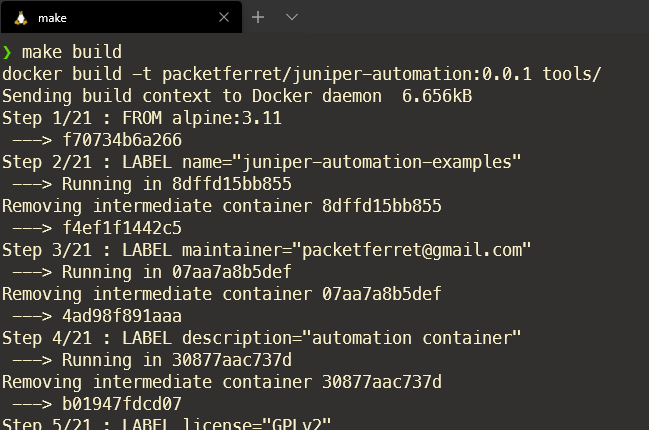

# Juniper Automation Examples

`Juniper Automation Examples` is a collection of different methods to automate your Juniper equipment. I hope to keep a focus on simply use-cases, such as configuration management and retreiving the output from operational commands.

## Project Structure

### examples/

A directory created for storing examples of various automation tools, such as python scripts, Ansible playbooks, and the like. If you're just here to download examples, this is the place to start looking.

### tools/

This directory holds a collection of tools to help you test the examples. We are providing a Dockerfile to make your experience a little easier to get started with, removing the need to install specific python libraries, or dealing with dedicated development virtual machines.

## Dependencies

If you plan on using an existing development, and feel comformtable adding a few more packages here-and-there, then feel empowered to bypass the shortcut methods I've provided with Make and Docker. You'll find a requirements.txt file in the `./tools/` directory, and if you're this type of person, you will know what to do with it.

If, however, you'd like to use the (arguably) easier method to getting started, you'll want a couple tools to help you get started.

### Windows

I am going to rock the boat here and declare that you need WSL2 for Windows. While many will (rightfully) argue that you can do most of these projects by installing Python on their workstations, the fact is this task is more daunting for newcomers; don't get me started on the virtualenv conversations.

By using WSL2 and Docker, both well supported prodcuts by Microsoft and Docker respectively, you get the same Linux developer environment that will port well between all operating systems.

- [Docker for Windows](https://docs.docker.com/docker-for-windows/install/)
- [WSL for Windows](https://docs.microsoft.com/en-us/windows/wsl/install-win10)
- [Using Docker with WSL guide](https://docs.docker.com/docker-for-windows/wsl/)
- [Installing Make](https://www.howtoinstall.me/ubuntu/18-04/make/)

### macOS

The typical bunch of tools for development:

- [Docker for macOS](https://docs.docker.com/docker-for-mac/install/)
- [Make for macOS](https://formulae.brew.sh/formula/make#default)

## How to Use

### Accessing the repository locally
- [Download this repository](https://github.com/packetferret/juniper-automation-examples/archive/master.zip) to your local machine 
- Unzip the downloaded archive file and browse to the directory from your terminal of choice

### Build the contianer

- simply type `make build` in the root directory of this project

If Docker is installed properly, this will build your very own copy of a Juniper Automation container to use for the project! Amazing!

### Accessing the examples within the container

- simply type `make ansible` to start the container with the `examples/ansible` directory mounted
- simply type `make python` to start the container with the `examples/python` directory mounted
- rinse and repeat for other projects

## Development

Want to contribute? Great!

Submit a PR and let's work on this together :D
