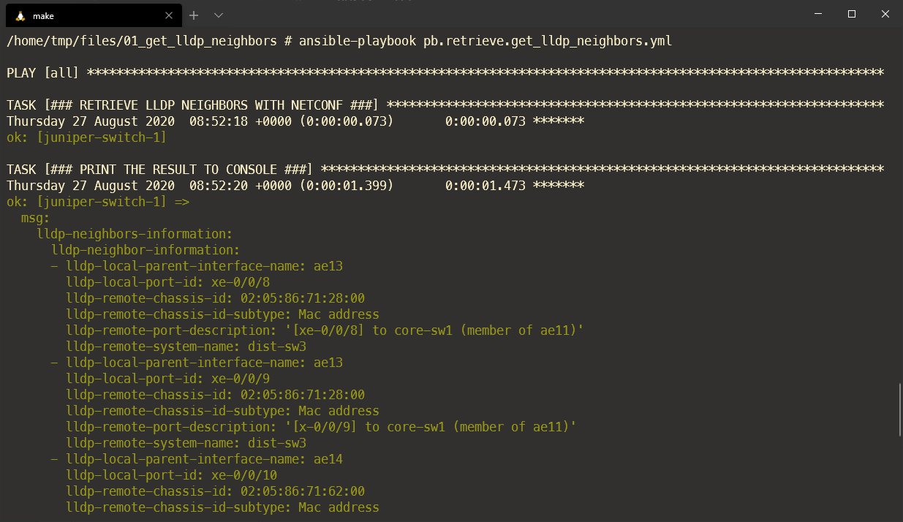

# NETCONF EXAMPLE: GET LLDP NEIGHBORS

This example will show how to use Ansible to perform a remote procedure call (RPC) to Juniper's NETCONF API. 

## To run the playbook

1. [start the ansible container ](https://github.com/packetferret/juniper-automation-examples#ansible)
2. type `ansible-playbook pb.retrieve.get_lldp_neighbors.yml`

## How it works

The playbook works like this:

- We will be requesting the LLDP neighbor information
- The output will be stored as an object called `output_lldp_neighbors`
- We print the object's "parsed_output" dictionary to the terminal

## examples screenshot

